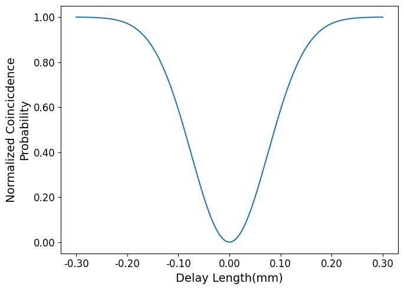

`OptiQuantum` is a physics-based modeling platform written in python for evaluating quantum effects in optical processor meshes.  The physics-based framework itself can perform modeling for any circuit with a well-defined transfer matrix.  However, `neuroptica` and `Strawberry Fields` are incorporated to characterize effects in an optical processor.  The repository itself was forked from the [Xoreus version of `neuroptica`](https://github.com/Xoreus/neuroptica) with OptiQuantum added to the `neuroptica` framework. 

`OptiQuantum` requires that python >=3.6 and python <=3.10
`Optiquantum` requires the following packages:
    `numpy`,
    `scipy`,
    `numba`,
    `tqdm`,
    `thewalrus`,
    `strawberryfields`

## Quick Start
1. Locate the [tutorial.ipynb](https://github.com/richardschung/OptiQuantum/blob/main/tutorial.ipynb) file
2. Run the code in the "Getting Started" section
3. Determine which metric(s) to evaluate (HOM interferometry, HOM visibility, circuit fidelity, biphoton transmittance)
4. Circuit fidelity and biphoton transmittance should be evaluated by running the code in section 1.  HOM interferometry and HOM visibility should be evaluated by running the code in section 2.

An example of the HOM interferometry simulation:

## Advanced Notes
`neuroptica` and `Strawberry Fields` are used to evaluate the transfer matrix.  Currently, the metric evaluation functions are dependent on transfer matrix calculation functions from classes in `neuroptica`.  However, `Strawberry Fields` is never required during metric evaluation.  This means that `Strawberry Fields` can be bypassed if you already know the required phases to program onto MZIs in a mesh.

## Authors
`OptiQuantum` was written by [Richard Chung](https://github.com/richardschung).

`Neuroptica: Towards a Practical Implementation of Photonic Neural Networks` was written by [Simon Geoffroy-Gagnon](https://s-g-gagnon.research.mcgill.ca/), with help from Farhad Shorkaneh.

The original `neuroptica` was written by [Ben Bartlett](https://github.com/bencbartlett), [Momchil Minkov](https://github.com/momchilmm), [Tyler Hughes](https://github.com/twhughes), and  [Ian Williamson](https://github.com/ianwilliamson).
